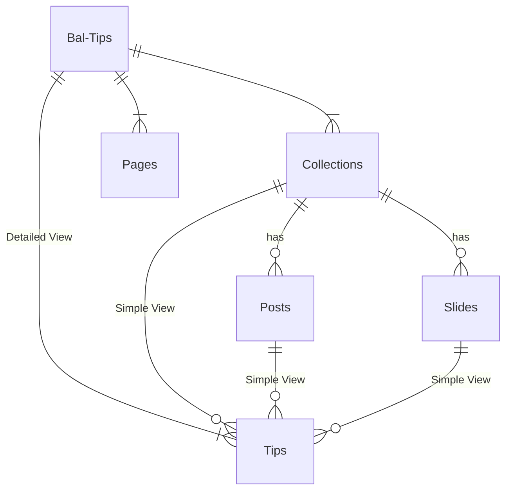

# [Bal.Tips](https://bal.tips)

⚠ Warning. A Draft content 🚧.

## 🖥 Development Environment  

- Hugo v0.100.2+extended
- Ballerina 2022.1.1
- Java 11

## 🌏 Start the Local Server

- Clone the repo.
- Start `hugo server` inside the cloned directory.
- You can access the local server @ [http://localhost:1313](http://localhost:1313).

## 🗄 Content Structure

This website contains the following content types.
- Collection
  - A top-level menu item, which includes a set of Posts or Tips.
  - Groups related topics.
- Post
  - A Page under a Collection.
  - Written for a specific topic.
- Tip
  - A Tip, usually created under content/examples dir. Can have code examples.
  - A Tip has two views
    - Simple View - Summary + Code Example, which will be rendered in a Collection or a Post.
    - Detailed View - Full content, which can be viewed only by accessing its URL.
- Slide
  - Framework Add.
  - Details - TBD
- Pages
  - Any other pages.




### Creating New Tip

```cmd
PS >.\newtip.bat .\content\examples\expr\string_template\string-template.md
Content "E:\\baltipv3\\content\\examples\\expr\\string_template\\string-template.md" created
```

* Hyphen is used for space separators.
* Must have tags.
* Must have a Summary or lead paragraph separated by `<!--more-->`
* If the tip has codes, use `code` front-matter and `` 

#### Convention for writing code. 

* All Ballerina programs under `content/examples/` will be tested for configured Ballerina version. 
* Should not exceed 20 lines. Breaks into multiple programs and lists them under `code`.
* Have 3 kinds of Ballerina programs.
  * Service - Ballerina Services
    * Should end with `service.bal` prefix. 
    * Must have a Ballerina client called, `service-test.bal`, which should write only `Done` to stdout when it is done testing the service. 
  * Error - Programs that contain invalid semantics
    * Should end with `-error.bal`
    * Should fail the compilation.
    * Use `// ^ Error` Syntax to point to the Diagnostic range in the next line. Use `//~ ^ Error` Syntax to skip the Validation.
  * Output - Programs that write to stdout.
    * All other Ballerina programs are considered Output programs.
    * Must have `.out` file with stdout result. 
