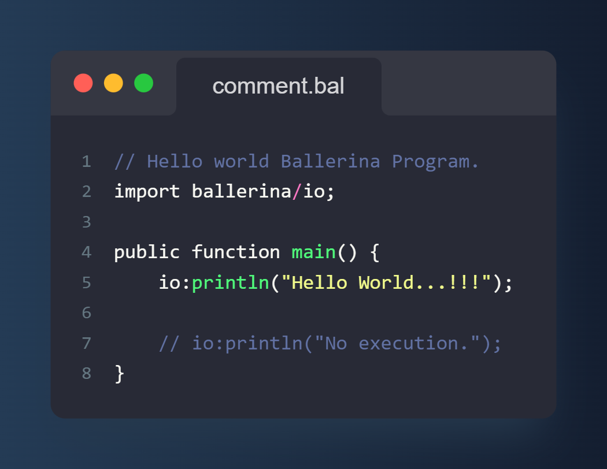

# Comments

Comments are used to provide more details about the code or temporally disable a section of the source code.

<!--more-->

## Syntax



* `//`



A comment starts with two forward slashes `//`. The compiler ignores any characters between `//` and the end of the line. Ballerina supports only single-line comments.

This example shows how you can use comments.



📌::: 1::: This is a comment. It provides more details about the code.
📌::: 8::: This is commented out code and will not be executed.

 

📌::: 4 ::: This is another comment, but **do not** use comments to document functions; Instead, use markdown documentation syntax.
📌::: 6 ::: This is an inline comment, but the code is self-explanatory. Avoid such comments.
📌::: 11::: This comment is unnecessary and should be avoided in favor of clear, concise code.



## No Multiline Comments

Multi-line comments are useful when providing large text descriptions or commenting on multiple lines of the code. Many languages use `/*  */` syntax for multiline comments. **Ballerina does not support this syntax**. Instead, you can use multiple `//` comments for the same purpose.

IDEs such as **VSCode** provide better support when commenting out multi-line code blocks. Select lines you want to comment on, then press `Ctrl` + `/` key.

## Comments, Docs, and Metadata

It is common to keep documentation within the source code because it is easy to keep up-to-date documentation with the code changes. In many programming languages, Documentation is kept as comments & sometimes formatted in a particular way (e.g.: `/** */` syntax in Java).

In Ballerina, you can use markdown documentation syntax to document Ballerina constructs. Ballerina markdown documentation starts with `#`. It is a common mistake that the developer uses comments (`//`) for documentation purposes.

Some programming languages often use comments to store metadata about the program. In Ballerina, you can use `annotation` for this purpose. But usually, you don't need to define annotations, unless you are building a low-level connector or extending compiler functionalities. If you are not sure whether you need to use annotation, you probably don't need it, get help from the Ballerina Team. :)

## Code Is Read More Than It Is Written


"Code never lies, comments sometimes do."
<footer>— <cite>Ron Jeffries</cite></footer>


Rarely, you write perfect code and run forever. Coding is an iterative process; You need to add new features, improve your code, and fix bugs. So, you must continue reading your old code to know how/where to fix it.

So, write your code in a self-documenting or understandable way. Put comments if necessary. Do not make updating comments in sync with the source code is an excessive task.

## Conclusion

Below are the main points to remember:






* No Multiline Comments.
* Only for Comments.
* Do not document inside comments, use Markdown syntax instead.
* Avoid comments much as possible, use clear, concise code instead.


